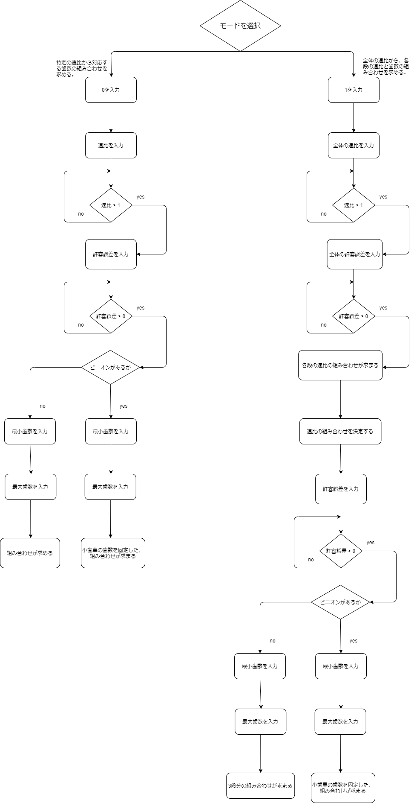

# プログラム仕様書
## このプログラムにできること
1. 1つの速比から1段の歯数の組み合わせを求める。
2. 全体の理想速比から、各段で出すべき速比を算出。その後、各段で使用できる歯数の組み合わせを求める。
3. 理想速比と許容範囲から、最小の速比と最大の速比を求める

### 使用方法
1. gearファイルに存在する`main.c`と`gear.c`,`shaft.c`,`global_function.c`を、コマンドプロンプトまたはcygwinでコンパイルして実行する。
    - コンパイル手順
        1. `cd ファイルのある階層のパス`
        2. `gcc main.c gear.c shaft.c global_function.c -o test`でコンパイル。 **`-o test`を忘れないこと。**
        3. コマンドプロンプト:`test`、chgwin:`./test`で実行
2. 以下のフローチャートに従ってプログラムを実行する。

